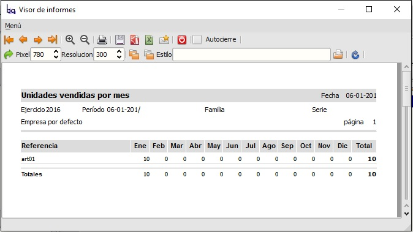
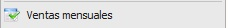

====================================================
Informe de unidades vendidas de cada artículo de una familia en cada mes o intervalo
====================================================

Informe de unidades vendidas de cada artículo de una familia en cada mes o intervalo.
Muestra todos los artículos de esa familia.
Se pueden definir intervalos distintos al mes natural

---------------------
Módulos que necesitan estar instalados previamente
---------------------

    * "facturacion/informes" name="flfactinfo"
    * "facturacion/facturacion" name="flfacturac"
    * "facturacion/principal" name="flfactppal"
    * "facturacion/almacen" name="flfactalma"
    

---------------------
Extensiones que necesitan estar instaladas previamente
---------------------

   * Ninguna

---------------------
Capturas de pantalla
---------------------

.. figure:: ./doc/ext0039-edicion-criterios-ventas-mes.jpg
   :width: 500px
   
   Edición de criterios de selección.
   
------

    
   Resultado-salida de un ejemplo de informe.
   
------

    
   Icono y titulo del menú en informes.
   
------
